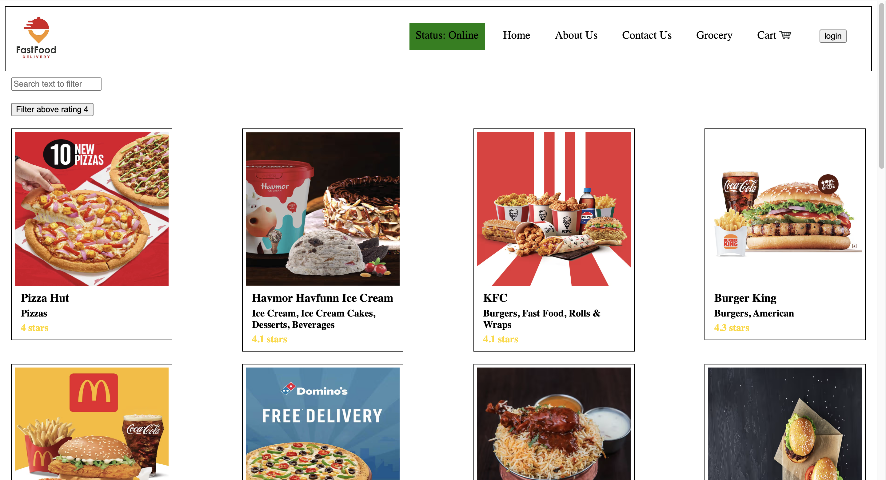

# React Food Delivery Project

## Food App

- Header
- - Logo
- - Nav Items
- Body
- - Search
- - RestaurantContainer
- - RestaurantCard
- - Img
- - Name of Res, Star Rating, Cuisine, Delivery Time
- Footer
- - CopyRight
- - Links
- - Address
- - Contact
    \*/

## 2 types of export/import

- Default Export/Import
  export default Component
  import Component from "path";

- Named Export/Import
  export const Component
  import {Component} from "path";

## React Hooks

- Normal JS utility functions
- 2 important hooks
  - useState() - Superpowerful State Variables in React
  - useEffect()

## React lifecycle

https://projects.wojtekmaj.pl/react-lifecycle-methods-diagram/

## Redux Toolkit

- Install @reduxjs/toolkit and react-redux
- Build our store
- Connect our store to app
- slice(cartSlice)
- dispatch(action)
- selector

## Types of Testing (developer)

- Unit Testing
- Integration Testing
- End to End Testing

## Setting up Testing in our app

- Install React Testing Library
- Install JEST
- Installed Babel dependency
- Configure Babel
- Configure Parcel COnfig file to disable default babel transpilation
- JEST -> npx jest --init
- Install jsdom library

- npm i -D @babel/preset-react => for JSX to run in tests
- Add to babel config
- Include @testing-library/jest-dom
